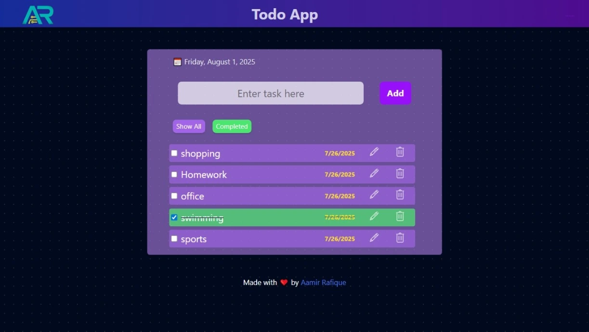

# 📝 React Todo App

A responsive and interactive To-Do List application built using **React** and **Tailwind CSS**, with persistent storage via **localStorage**.

---

## ✨ Features

- ✅ Add new tasks
- 🗑️ Delete tasks
- ✏️ Edit existing tasks
- ✔️ Mark tasks as completed
- 📂 Filter tasks (All / Completed)
- 📅 Show current date and day
- 💾 Save tasks in localStorage (persistent on refresh)
- 📱 Responsive design with Tailwind CSS
- Lordicons for interactivity

---

## 📸 Preview



---

## 🧑‍💻 Tech Stack

- React (via `create-react-app`)
- Tailwind CSS
- JavaScript (ES6+)
- LocalStorage for data persistence

---

## 🚀 Getting Started

### 📦 Prerequisites

- Node.js installed (v14 or above)
- npm or yarn

### 🛠️ Installation

```bash
# 1. Clone the repository
git clone https://github.com/Aamir-Rafique/Todo-app-React

# 2. Navigate into the folder
cd Todo-app-React

# 3. Install dependencies
npm install

# 4. Start the development server
npm start
# 📝 React To-Do List App

A responsive and interactive To-Do List application built using **React** and **Tailwind CSS**, with persistent storage via **localStorage**.

---

## ✨ Features

- ✅ Add new tasks
- 🗑️ Delete tasks
- ✏️ Edit existing tasks
- ✔️ Mark tasks as completed
- 📂 Filter tasks (All / Completed)
- 📅 Show current date and day
- 💾 Save tasks in localStorage (persistent on refresh)
- 📱 Responsive design with Tailwind CSS

---

# 📸 Preview

#  <!-- Optional: add screenshot of your app -->

# ---

## 🧑‍💻 Tech Stack

- React (via `create-react-app`)
- Tailwind CSS
- JavaScript (ES6+)
- LocalStorage for data persistence

---

## 🚀 Getting Started

### 📦 Prerequisites

- Node.js installed (v14 or above)
- npm 

### 🛠️ Installation

```bash
# 1. Clone the repository
git clone https://github.com/Aamir-Rafique/Todo-app-React

# 2. Navigate into the folder
cd Todo-app-React

# 3. Install dependencies
npm install

# 4. Start the development server
npm start
